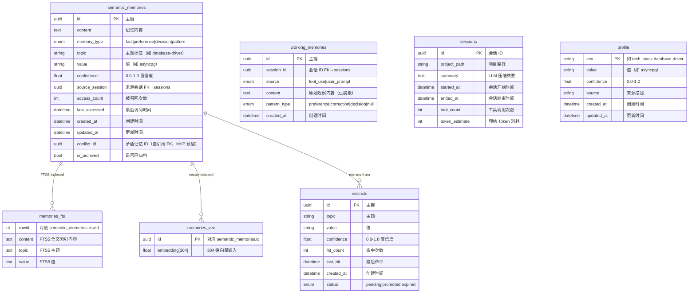
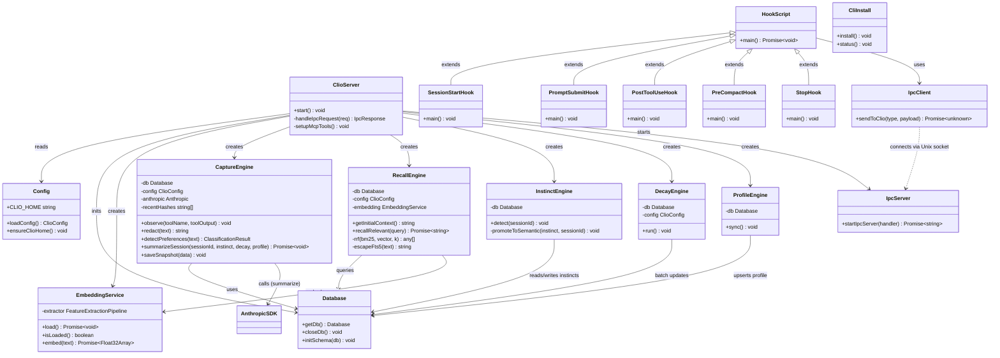
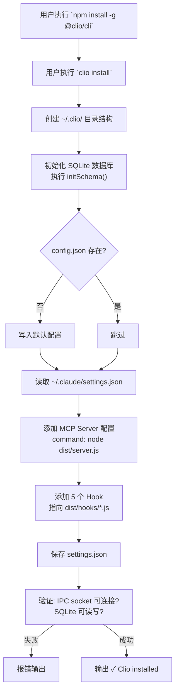
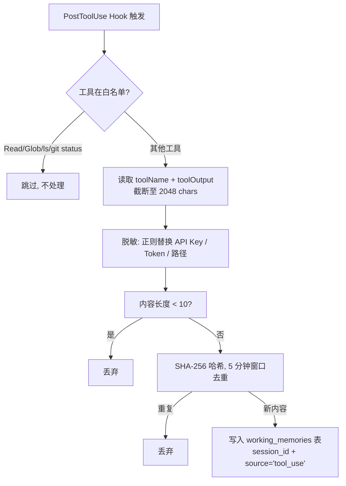
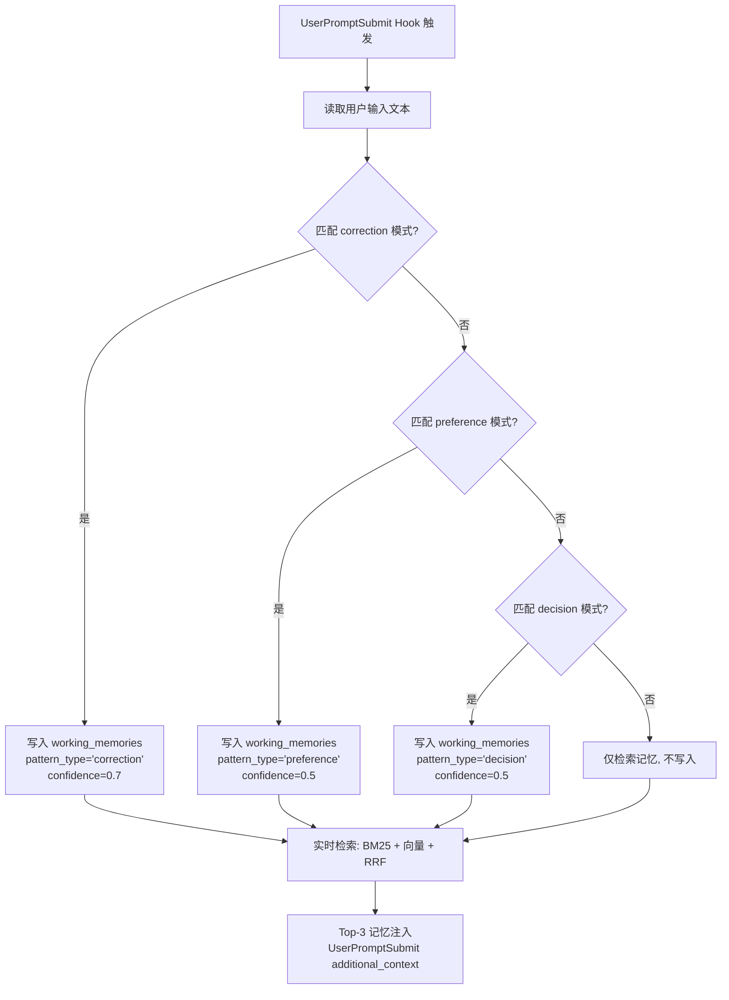
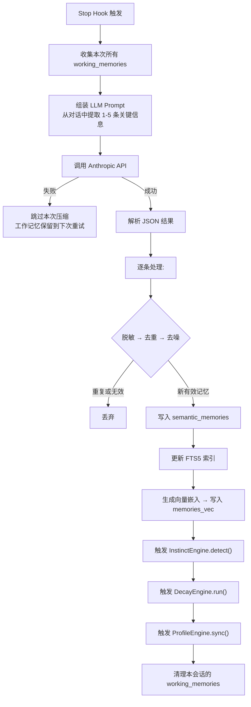
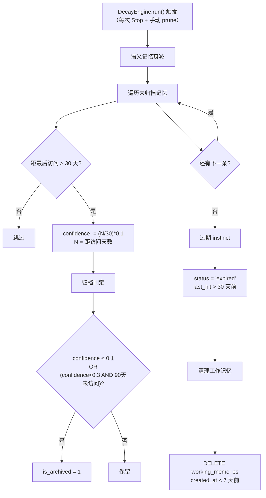
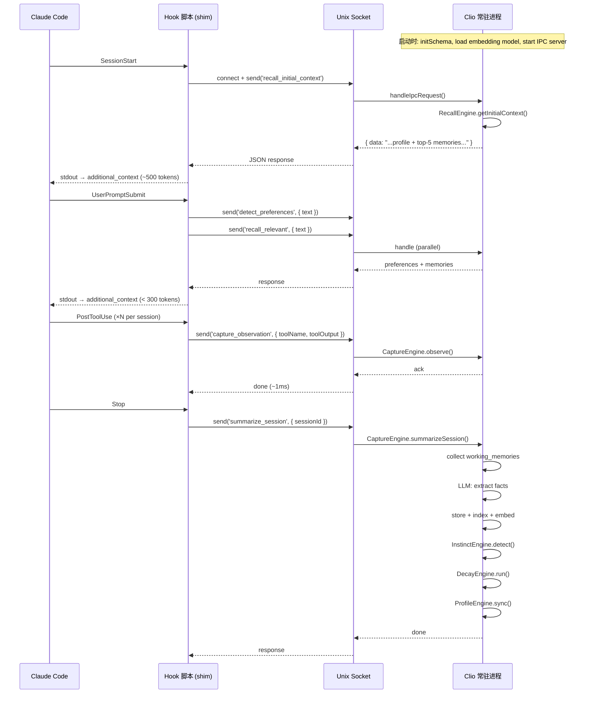

# Clio Architecture

> 核心设计图：ER 图、类图、流程图
> 日期：2026-05-19

---

## 1. ER 图



### 实体关系说明

| 实体 | 行数预估（MVP） | 清理策略 |
|------|----------------|----------|
| `semantic_memories` | ~500 条 | 置信度 < 0.1 自动归档 |
| `working_memories` | ~50,000 条 | 保留最近 7 天 |
| `instincts` | ~100 条 | pending 30 天 TTL 过期 |
| `sessions` | ~1,000 条 | 保留最近 90 天 |
| `profile` | ~20 条 | 永不清理 |
| `memories_fts` | ~500 行 | 随 semantic_memories 清理 |
| `memories_vec` | ~500 行 | 随 semantic_memories 清理 |

---

## 2. 类图



### 核心依赖关系

```
Engines 依赖 Storage，不依赖对方
  ┌──────────────────────┐
  │  ClioServer          │  ← 唯一组合所有模块的入口
  ├──────────────────────┤
  │  CaptureEngine       │  ← 调用 InstinctEngine + DecayEngine + ProfileEngine
  │  RecallEngine        │  ← 独立，只依赖 Database + EmbeddingService
  │  InstinctEngine      │  ← 独立
  │  DecayEngine         │  ← 独立
  │  ProfileEngine       │  ← 独立
  └──────────────────────┘
```

---

## 3. 核心流程图

### 3.1 安装流程



### 3.2 捕获流程（PostToolUse）



### 3.3 偏好检测流程（UserPromptSubmit）



### 3.4 会话结束压缩流程（Stop）



### 3.5 召回流程（SessionStart + UserPromptSubmit）

```mermaid
flowchart TD
    subgraph SessionStart
        A[SessionStart Hook] --> B[""调用 getInitialContext()""]
        B --> C["查询 semantic_memories<br>confidence>=0.7<br>排序: access*0.3+confidence*0.7"]
        C --> D[取 Top-5 + profile 全部条目]
        D --> E["组装 ~500 tokens<br>注入 system prompt"]
    end

    subgraph UserPromptSubmit
        F[用户输入] --> G[""调用 recallRelevant(text)""]
        G --> H[input → embedding → 向量检索 Top-10]
        G --> I[BM25 FTS5 检索 Top-10]
        H --> J[RRF 融合排序]
        I --> J
        J --> K[取 Top-3]
        K --> L[更新 access_count + last_accessed]
        L --> M[注入 additional_context]
    end
```

### 3.6 Instinct 进化流程

```mermaid
flowchart TD
    A["Stop: 新语义记忆写入"] --> B[""InstinctEngine.detect()""]
    B --> C["遍历每条新记忆"]
    C --> D{"topic 为空?"}
    D -->|是| E["跳过"]
    D -->|否| F{""instincts 表已有<br>相同 topic+value?""}
    F -->|否| G["创建 instinct<br>confidence=0.3, hit_count=1"]
    F -->|是| H["hit_count+1"]
    H --> I[""confidence = min(0.7, 0.3+hit*0.15)""]
    I --> J{""confidence >= 0.7<br>AND status = pending?""}
    J -->|否| K["更新 instinct"]
    J -->|是| L[""promoteToSemantic()""]
    L --> M["创建 pattern 类型语义记忆"]
    M --> N["instinct.status = promoted"]

    O[""0.3: 初始值 (首次出现)""] -.- P["0.45: hit=1 提升"]
    P -.- Q["0.6: hit=2"]
    Q -.- R["0.7: hit=3 达到 promotion 条件"]
```

### 3.7 衰减流程



---

## 4. 进程模型



---

## 5. 目录依赖关系

```
src/
├── index.ts              # CLI 入口 (bin)
│   └── 依赖: config.ts, storage/database.ts
├── server.ts             # 常驻进程入口
│   └── 依赖: 全部 engines + storage + ipc + config
├── config.ts             # 无依赖
├── ipc/
│   ├── protocol.ts       # 无依赖（纯类型定义）
│   └── server.ts         # 依赖: config.ts
├── storage/
│   ├── database.ts       # 依赖: better-sqlite3
│   └── embedding.ts      # 依赖: @xenova/transformers, config.ts
├── engines/
│   ├── capture.ts        # 依赖: database.ts, instinct/decay/profile engines
│   ├── recall.ts         # 依赖: database.ts, embedding.ts
│   ├── instinct.ts       # 依赖: database.ts
│   ├── decay.ts          # 依赖: database.ts, config.ts
│   └── profile.ts        # 依赖: database.ts
└── hooks/
    ├── ipc-client.ts     # 依赖: net (Node built-in)
    ├── session-start.ts  # 依赖: ipc-client.ts
    ├── prompt-submit.ts  # 依赖: ipc-client.ts
    ├── post-tool-use.ts  # 依赖: ipc-client.ts
    ├── pre-compact.ts    # 依赖: ipc-client.ts
    └── stop.ts           # 依赖: ipc-client.ts
```
