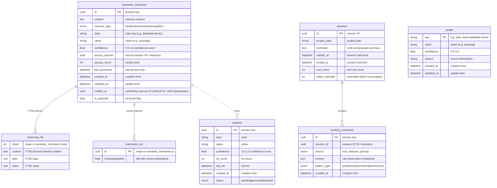
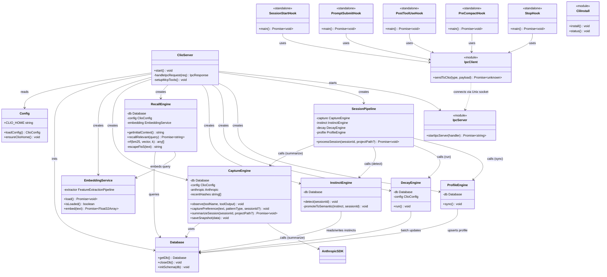
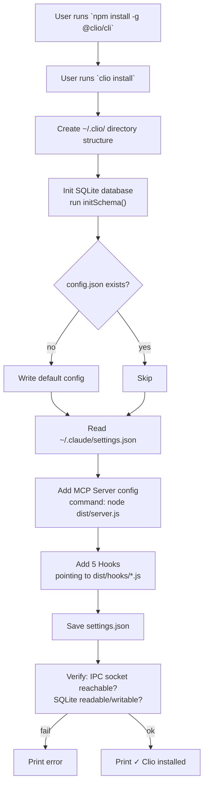
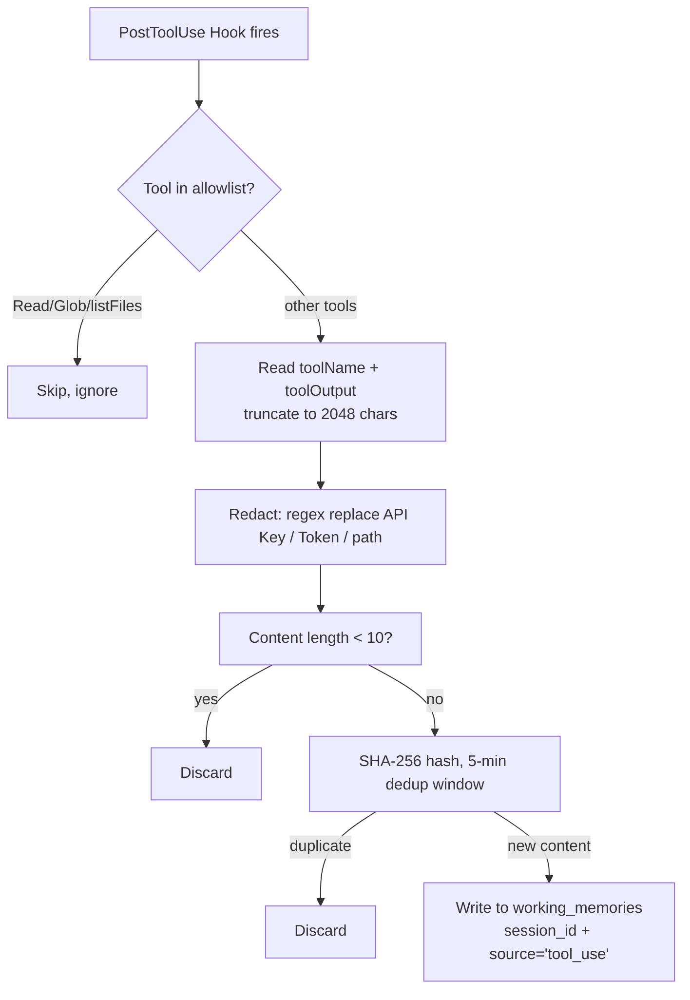
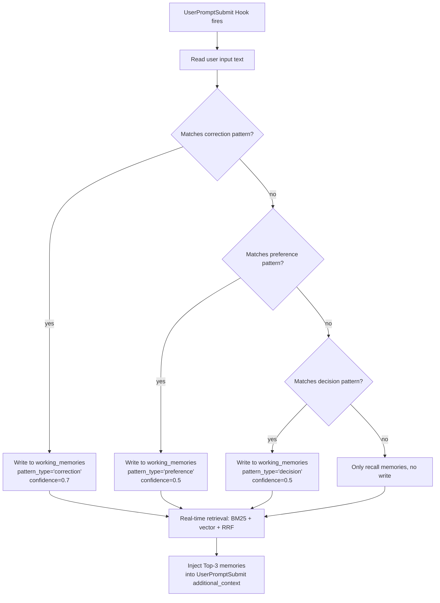
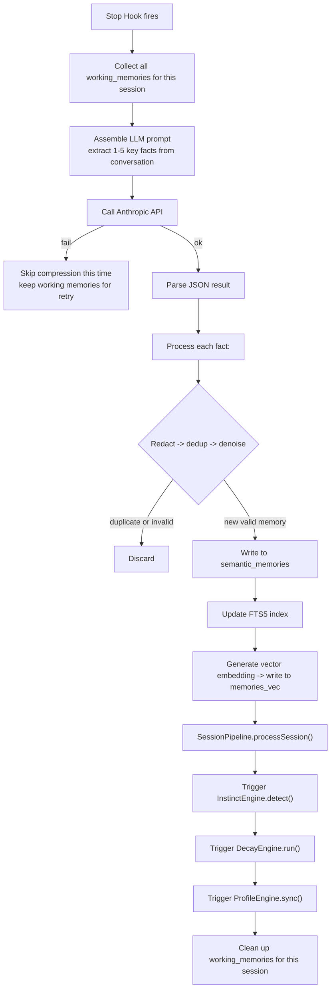
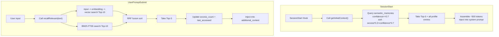
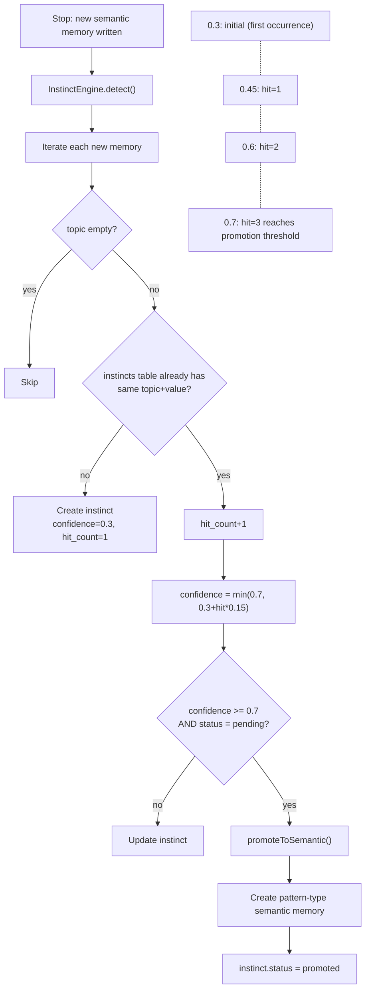
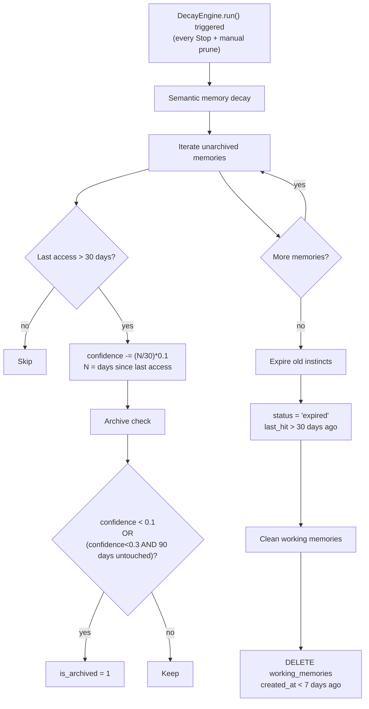
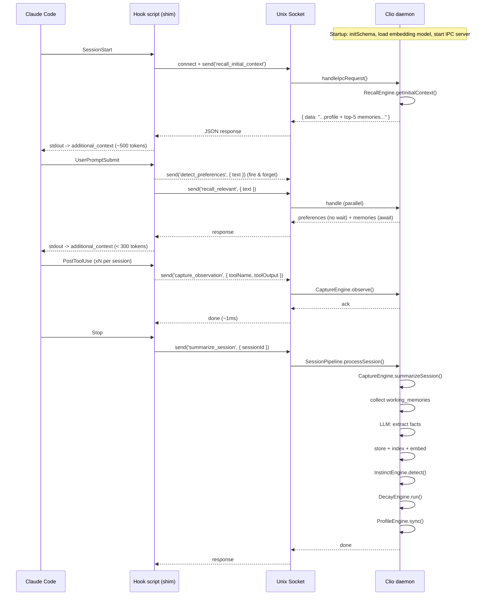

# Clio Architecture

> Core diagrams: ER, class, and flow diagrams
> Date: 2026-05-19

---

## 1. ER Diagram



### Entity Relationship Notes

| Entity | Est. Rows (MVP) | Cleanup Strategy |
|--------|-----------------|------------------|
| `semantic_memories` | ~500 | auto-archive when confidence < 0.1 |
| `working_memories` | ~50,000 | keep last 7 days |
| `instincts` | ~100 | pending TTL expires after 30 days |
| `sessions` | ~1,000 | keep last 90 days |
| `profile` | ~20 | never clean |
| `memories_fts` | ~500 | cleaned with semantic_memories |
| `memories_vec` | ~500 | cleaned with semantic_memories |

---

## 2. Class Diagram



### Core Dependencies

```
Engines depend on Storage, not on each other
  ┌──────────────────────┐
  │  ClioServer          │  ← single entry point composing all modules
  ├──────────────────────┤
  │  SessionPipeline     │  ← orchestrates: CaptureEngine ➔ InstinctEngine ➔ DecayEngine ➔ ProfileEngine
  │  CaptureEngine       │  ← standalone (capture + LLM summarization only)
  │  RecallEngine        │  ← standalone, only depends on Database + EmbeddingService
  │  InstinctEngine      │  ← standalone
  │  DecayEngine         │  ← standalone
  │  ProfileEngine       │  ← standalone
  └──────────────────────┘
```

---

## 3. Core Flowcharts

### 3.1 Install Flow



### 3.2 Capture Flow (PostToolUse)



### 3.3 Preference Detection Flow (UserPromptSubmit)



### 3.4 Session End Compression Flow (Stop)



### 3.5 Recall Flow (SessionStart + UserPromptSubmit)



### 3.6 Instinct Evolution Flow



### 3.7 Decay Flow



---

## 4. Process Model


